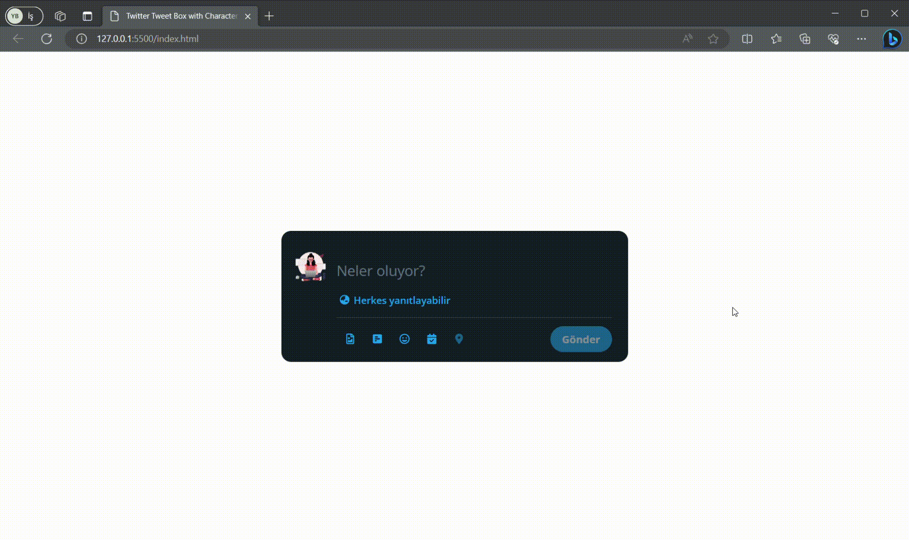

<h1>Twitter-Tweet-Box</h1>

This project aims to create a Twitter-like tweet box using HTML, CSS and JavaScript and highlight character limit and excess characters during text entry. When users tweet when the character limit is exceeded, excess characters are marked and the limitation status is indicated by color.

<h2>Technologies Used</h2>
<h3>The website was developed using the following technologies:</h3>

HTML
CSS
Javascript

